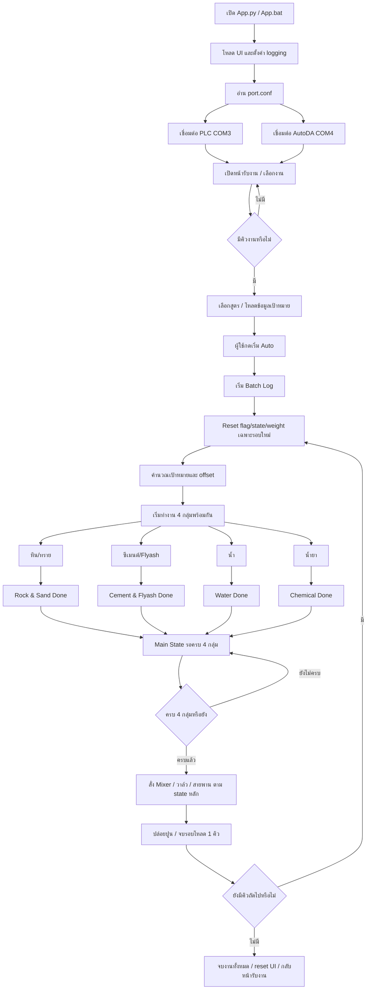
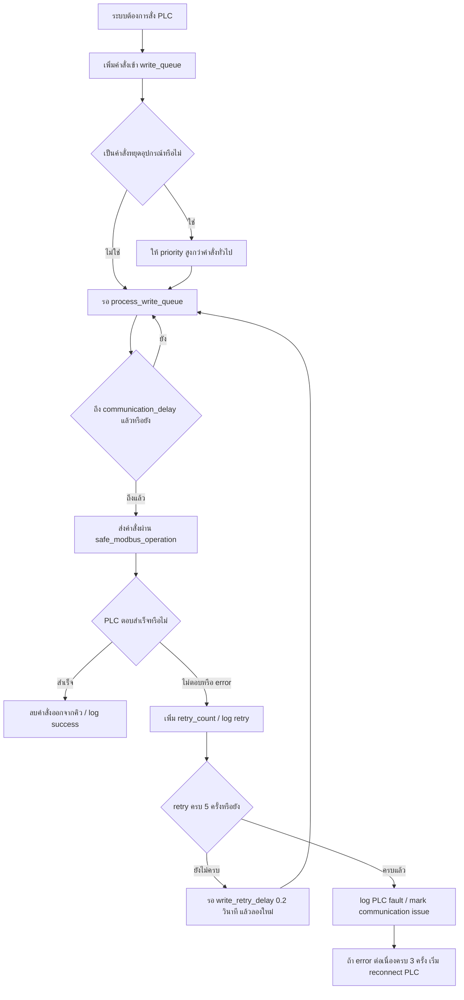
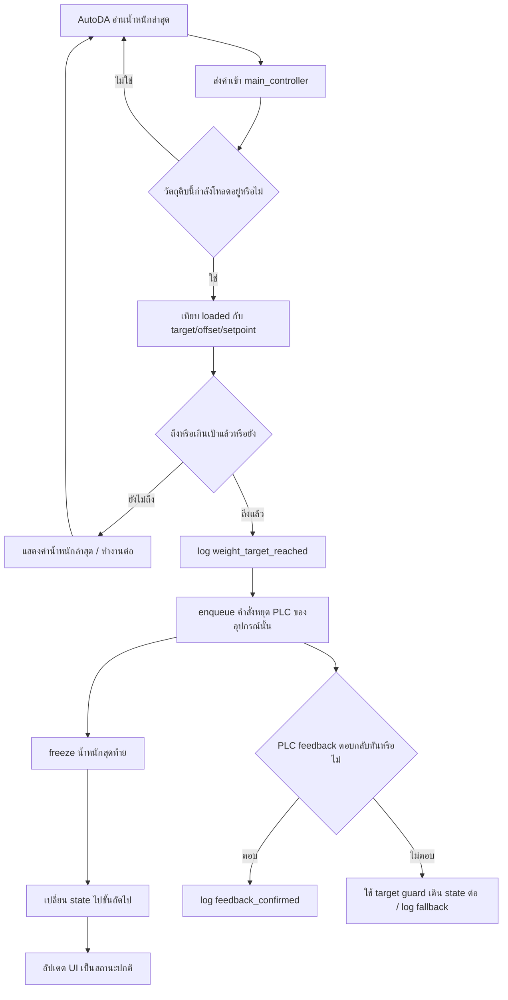
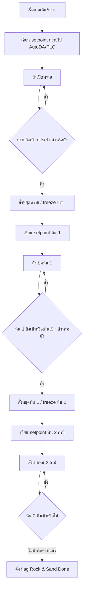
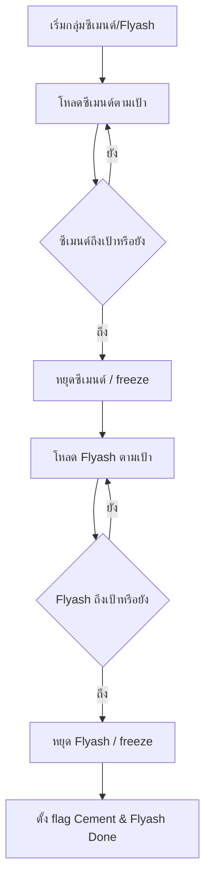
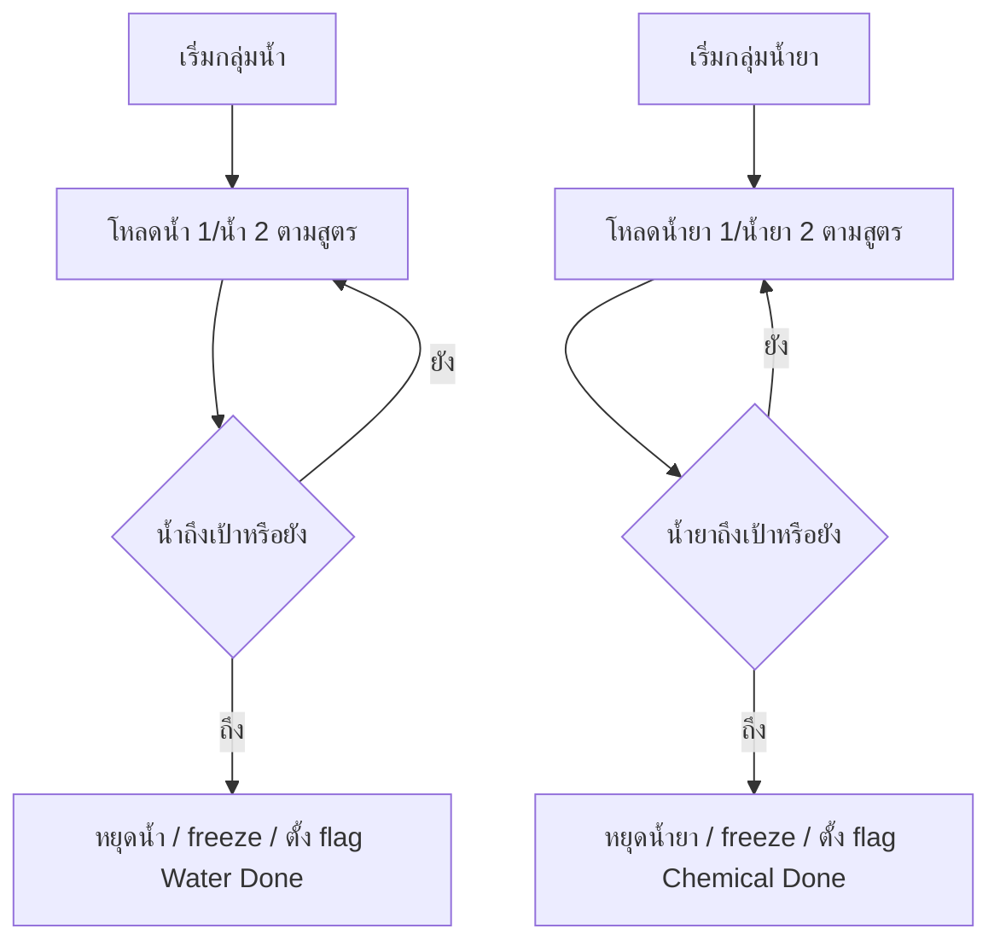
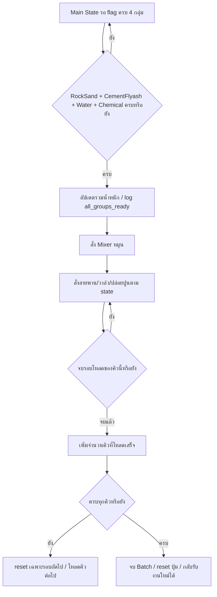

# ผังระบบการทำงานหลังแก้ไขล่าสุด

เอกสารนี้สรุป flow การทำงานของโปรแกรมชุดปัจจุบัน ตั้งแต่เปิดโปรแกรมจนโหลดครบทุกคิว รวมถึง flow กรณีสื่อสาร PLC/AutoDA ไม่ตอบสนอง และคำอธิบายค่า timeout / communication delay ที่ใช้อยู่จริงในระบบ

## 1. ภาพรวมตั้งแต่เปิดโปรแกรมจนจบงาน

## 2. Flow การสั่งงาน PLC และการ retry

ทุกคำสั่งที่ต้องเขียนไป PLC จะไม่ยิงตรงแบบกระจัดกระจาย แต่เข้าคิวเขียนก่อน แล้วให้ worker ของ PLC จัดการตามลำดับ เพื่อลดอาการคำสั่งชนกันบน serial line

## 3. Flow การอ่านน้ำหนักและตัดเมื่อถึงเป้า

หลักสำคัญของชุดแก้ไขล่าสุดคือไม่ได้รอแค่ feedback จาก PLC อย่างเดียว แต่เพิ่ม guard จากน้ำหนักจริงที่ AutoDA อ่านได้ ถ้าน้ำหนักถึงหรือเกิน setpoint แล้ว ระบบจะ enqueue คำสั่งหยุด PLC ทันที และ freeze ค่าน้ำหนักของวัตถุดิบนั้นไว้เพื่อไม่ให้ UI เด้งกลับหรือค้างสีเขียวผิดจังหวะ

## 4. Flow กลุ่มหินและทราย

กรณีผิดปกติที่ระบบต้องจับ:

- หิน/ทรายถึงเป้าแล้ว แต่ PLC feedback ไม่กลับมา: ระบบใช้ target guard สั่งหยุดและเดิน state ต่อ พร้อม log จุดที่ fallback
- PLC เขียนคำสั่งหยุดไม่สำเร็จ: คำสั่งยังอยู่ในคิวและ retry สูงสุด 5 ครั้ง
- PLC ไม่ตอบต่อเนื่อง: error count ครบ 3 ครั้งจะ reconnect PLC และ log เหตุการณ์
- AutoDA ส่งค่าน้ำหนัก 0 หรืออ่านไม่ได้: ระบบ log การอ่านผิดปกติ ทำให้ตรวจได้ว่าเป็นปัญหาฝั่ง scale/AutoDA หรือ logic โปรแกรม

## 5. Flow กลุ่มซีเมนต์/Flyash

## 6. Flow กลุ่มน้ำและน้ำยา

## 7. Flow หลังวัตถุดิบครบ 4 กลุ่ม

## 8. Timeout / Communication Delay คืออะไร

### timeout

`timeout` คือเวลาสูงสุดที่โปรแกรมจะรอคำตอบจากอุปกรณ์หลังส่งคำสั่ง Modbus ไป ถ้าเกินเวลานี้แล้วยังไม่มีคำตอบ จะถือว่า request นั้นไม่สำเร็จหรือ `no response`

ค่าปัจจุบัน:

| ส่วน | ค่าจาก config | ค่าที่ใช้จริง |
| --- | ---: | ---: |
| PLC | `TIMEOUT_ERROR = 3` วินาที | ถูก clamp อยู่ในช่วง `1.5-2.0` วินาที และรอบนี้ใช้จริง `2.0` วินาที |
| AutoDA | `TIMEOUT_ERROR = 3` วินาที | ใช้จริง `3` วินาทีใน `Autoda_controller.py` |

### communication_delay

`communication_delay` คือระยะห่างขั้นต่ำระหว่างการส่งคำสั่ง Modbus ไป PLC เพื่อไม่ให้ยิงคำสั่งถี่เกินไปจน PLC/serial line ตอบไม่ทัน

ค่าปัจจุบันใน `PLC_controller.py`:

| ค่า | ปัจจุบัน | ใช้กับ |
| --- | ---: | --- |
| `communication_delay` | `75 ms` | เว้นช่วงก่อนเขียนคำสั่ง PLC ครั้งถัดไป |
| `read_delay` | `350 ms` | เว้นช่วงก่อนอ่าน PLC ครั้งถัดไป |
| `write_retry_delay` | `0.2 s` | เว้นช่วงก่อน retry คำสั่งเขียนที่ fail |
| `max_write_retries` | `5` ครั้ง | จำนวน retry ก่อนถือว่าคำสั่งเขียนมีปัญหา |
| `max_error_count` | `3` ครั้ง | error ต่อเนื่องก่อนเข้าสู่ logic reconnect/fault |

### ตอนนี้เหมาะกับ hardware จริงหรือยัง

จากโค้ดรอบล่าสุดได้ปรับค่าป้องกันเบื้องต้นแล้ว แต่ยังยืนยันไม่ได้ 100% ว่าเหมาะกับ hardware จริงทุกสถานการณ์ เพราะต้องดู response time จริงของ PLC/AutoDA ตอนเครื่องทำงานจริง

ค่าปัจจุบันถือว่า:

- ฝั่ง PLC write เว้นจังหวะมากขึ้น: `75 ms`
- ฝั่ง PLC read เว้นจังหวะมากขึ้น: `350 ms`
- PLC timeout ที่ใช้จริงยาวขึ้น: `2.0 s`
- AutoDA timeout ยาวกว่า: `3 s`
- คำสั่ง stop มี priority สูงสุด และคำสั่ง start ที่ชนกับ stop ค้างอยู่จะถูกบล็อกไว้ก่อน
- คำสั่งซ้ำในคิวจะไม่รีเซ็ต retry เดิม โดยเฉพาะคำสั่ง stop
- fault จากคำสั่ง stop/write ที่ fail จะไม่ถูก clear ด้วย read สำเร็จธรรมดา ต้อง clear จากคำสั่งเดิมที่ส่งสำเร็จจริงหรือการแก้ไขตามเงื่อนไข fault

ถ้า log หน้างานยังเจอข้อความกลุ่มนี้บ่อย แปลว่าควรปรับเพิ่ม delay/timeout:

- `operation_no_response`
- `write_queue_retry_scheduled`
- `write_queue_operation_failed`
- `reconnect_begin`
- `PLC fault`
- น้ำหนักถึงเป้าแล้วแต่ PLC ตัดช้า

แนวทาง tuning ที่ควรทดสอบกับเครื่องจริง:

| อาการ | แนวทางทดลอง |
| --- | --- |
| PLC ไม่ตอบบ่อย | ปรับแล้ว: `communication_delay` จาก `20 ms` เป็น `75 ms` |
| อ่านสถานะ PLC ไม่ทันหรือไม่เสถียร | ปรับแล้ว: `read_delay` จาก `200 ms` เป็น `350 ms` |
| timeout เกิดทั้งที่ PLC ยังทำงาน | ปรับแล้ว: PLC timeout จาก `1 s` เป็นช่วง `1.5-2.0 s` และ config ปัจจุบันใช้จริง `2.0 s` |
| คำสั่งหยุดช้าเพราะคิวแน่น | ปรับแล้ว: stop priority สูงสุด, start ที่ชนกับ stop ถูกบล็อก, duplicate stop ไม่รีเซ็ต retry |

## 9. สรุปสถานะปัจจุบัน

- ระบบเปิดโปรแกรมแล้วเชื่อม PLC/AutoDA ตาม `port.conf`
- Batch ใหม่จะ reset state/flag/weight ก่อนเริ่มคิว
- แต่ละกลุ่มวัตถุดิบทำงานแยกกัน และ main state รอครบ 4 กลุ่ม
- เมื่อวัตถุดิบถึงเป้า ระบบใช้ target guard สั่งหยุดและ freeze น้ำหนัก ไม่รอ PLC feedback เพียงทางเดียว
- คำสั่ง PLC เข้าคิวและ retry ได้
- มี reconnect/fault log เมื่อ PLC ไม่ตอบต่อเนื่อง
- หลังโหลดครบทุกคิว ระบบควรกลับไปรับงานใหม่ได้โดยไม่ต้องปิดเปิดโปรแกรม
- จุดที่ยังต้องยืนยันกับ hardware จริงคือค่า timeout, read delay, communication delay ว่าพอดีกับ PLC/AutoDA หน้างานหรือไม่
