# Loading Flow State Diagram

วันที่จัดทำ: 2026-06-17

เอกสารนี้สรุป step การทำงานหลังการแก้ไขล่าสุด โดยเน้น flow ตั้งแต่เริ่มโหลดวัตถุดิบจนโหลดเสร็จ, ลำเลียงเข้าโม่, ผสม, ปล่อยออก และกรณีผิดปกติที่ยังอาจเกิดขึ้นได้

> หมายเหตุ: diagram ใช้ Mermaid เปิดดูได้ใน Markdown viewer ที่รองรับ Mermaid

## ภาพรวมระบบหลังแก้ไข

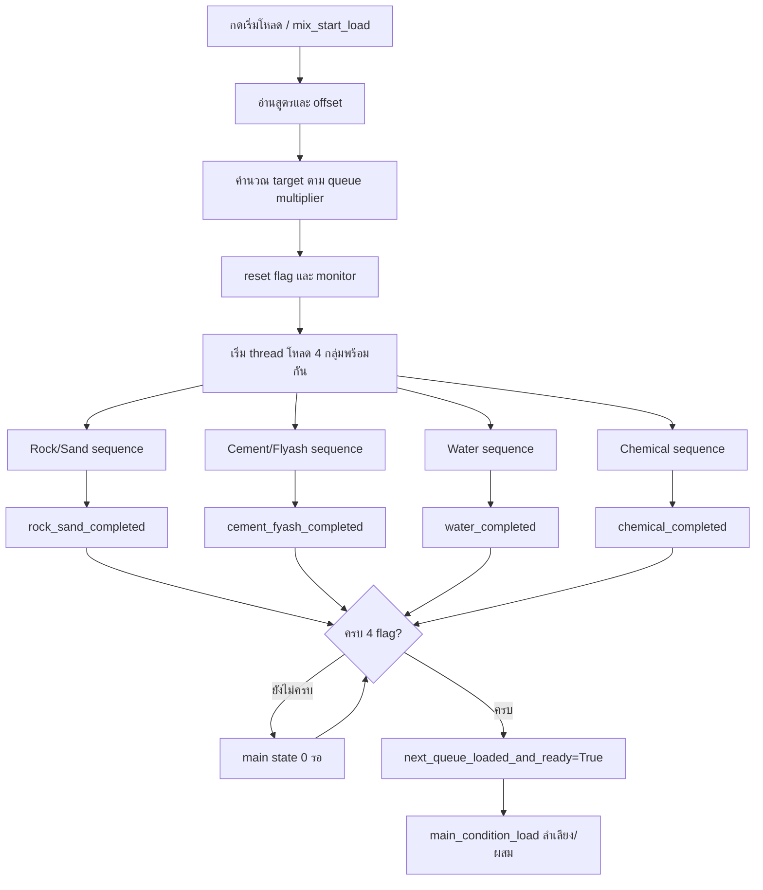

สิ่งที่เปลี่ยนจากเดิม:

- เดิมบางกลุ่มใช้ `if x == x` ทำให้ write setpoint แล้วเริ่มโหลดเลยโดยไม่สน feedback
- ตอนนี้ทุกกลุ่มต้อง `write setpoint -> read feedback -> feedback ตรง target` ก่อนสั่ง PLC start
- เดิม C&F เคยโหลดเสร็จแล้ว flag ไม่เปลี่ยนถ้าไม่มี PLC status callback รอบถัดไป
- ตอนนี้ทุกกลุ่มมี completion signal ของตัวเองแล้ว

## Helper Confirm Setpoint กลาง

ทุก material group ใช้แนวคิดเดียวกันก่อนเริ่มโหลดจริง

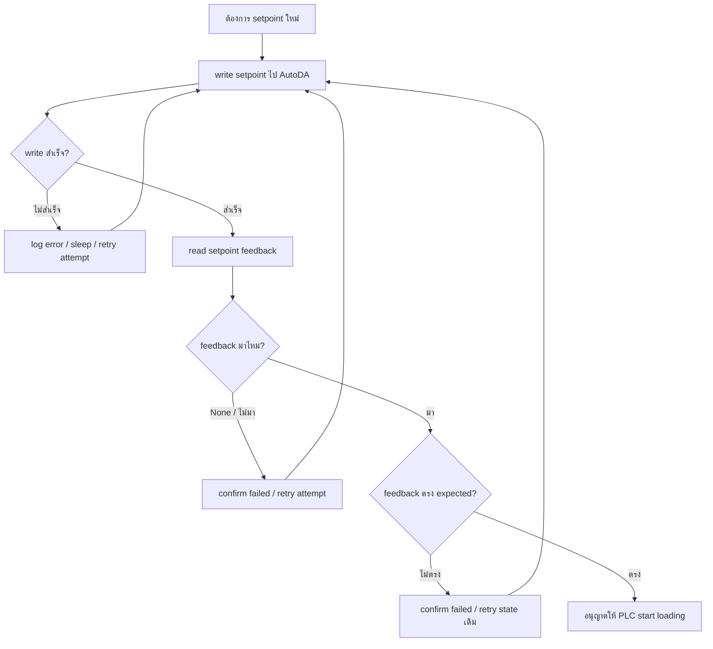

ผลของการแก้:

- AutoDA read setpoint failure จะ emit `None` แทน `0`
- ถ้า feedback เป็น `0` แต่ target ไม่ใช่ `0` จะไม่ผ่าน confirm
- ถ้า material target เป็น 0 ระบบจะใช้ branch skip แทนการโหลด

## Main Condition State

หลังวัตถุดิบครบ 4 กลุ่มแล้ว main loop จะลำเลียง/ผสมตาม state นี้

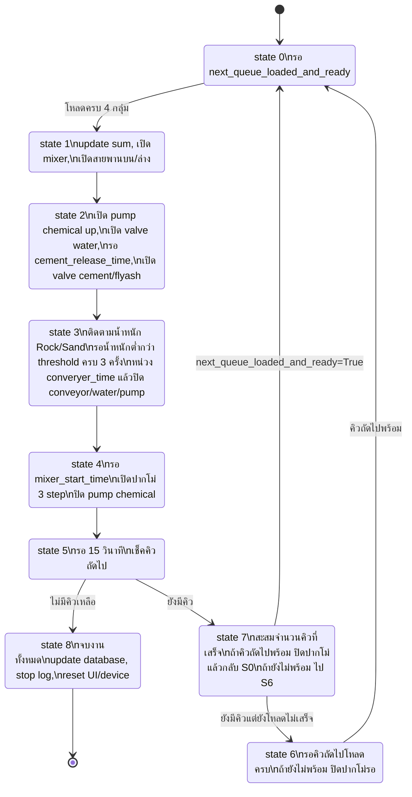

## Rock/Sand Normal Flow

ลำดับโหลดคือ Sand -> Rock1 -> Rock2

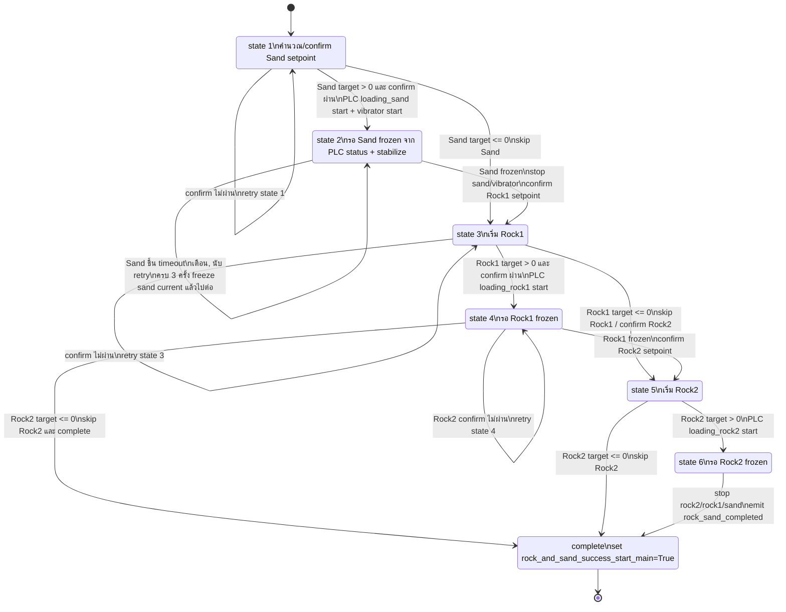

กรณีพิเศษ:

- ถ้า queue multiplier < 1.0 จะมีการปรับ setpoint Rock1/Rock2 ตามน้ำหนักจริงที่โหลดได้ แล้ว confirm setpoint ที่ปรับแล้วก่อนโหลด
- ถ้าไม่มี Rock2 หลัง Rock1 เสร็จ ตอนนี้ complete ได้ทันที ไม่ค้างที่ state 4 แล้ว

## Cement/Flyash Normal Flow รวมการเติมปูน

ลำดับโหลดคือ Flyash -> Cement และ Cement มี state ตรวจ/เติมละเอียด

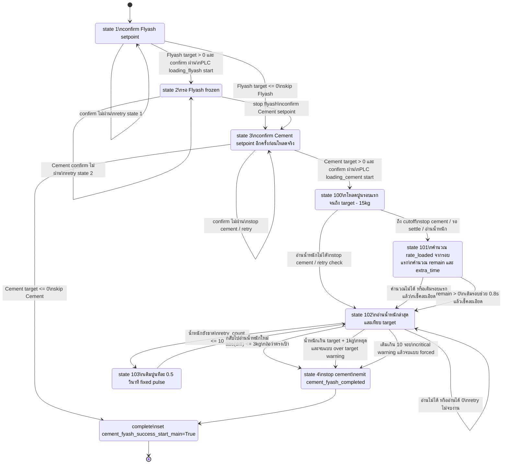

จุดสำคัญ:

- state 103 ยังเป็น fixed pulse `0.5` วินาทีตามที่ทดสอบกับ hardware จริงแล้ว
- state 102 ถ้าอ่านน้ำหนักปูนได้ `0` จะไม่ถือว่าเสร็จ แต่ retry ต่อ
- ถ้าอ่านน้ำหนักไม่ได้จะ stop cement แล้ว retry check

## Water Normal Flow

```mermaid
stateDiagram-v2
    [*] --> W1
    W1: state 1\nconfirm Water setpoint
    W1 --> W2: Water target > 0 และ confirm ผ่าน\nPLC loading_water start
    W1 --> Done: Water target <= 0\nskip Water
    W1 --> W1: confirm ไม่ผ่าน\nstop water / retry state 1

    W2: state 2\nรอ Water frozen จาก PLC status + stabilize
    W2 --> W3: frozen แล้ว stop water

    W3: state 3\nset success\nemit water_completed
    W3 --> Done

    Done: complete\nset water_success_start_main=True
    Done --> [*]
```

## Chemical Normal Flow

ลำดับโหลดคือ Chemical 1 -> Chemical 2

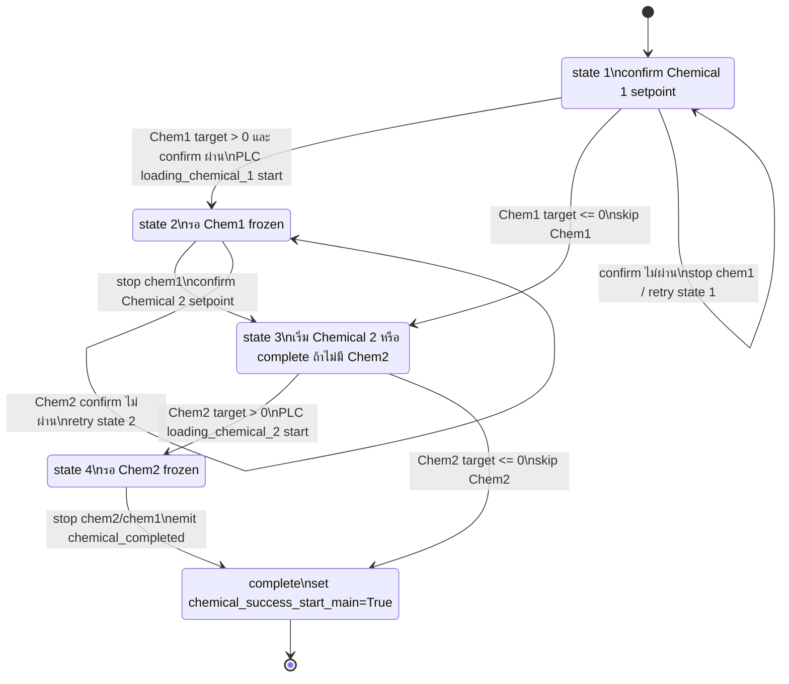

## Abnormal Flow: Setpoint เขียน/อ่านไม่ได้

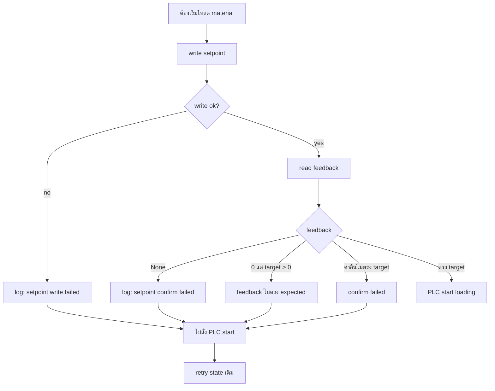

ต่างจากเดิม:

- เดิม write แล้วผ่าน `if x == x` จึงเริ่มโหลดได้แม้ AutoDA ไม่ตอบกลับ
- ตอนนี้ถ้า AutoDA อ่าน setpoint ไม่ได้ จะเป็น `None` และไม่เริ่มโหลด

## Abnormal Flow: AutoDA ส่งค่า 0

แบ่งเป็น 2 ประเภท:

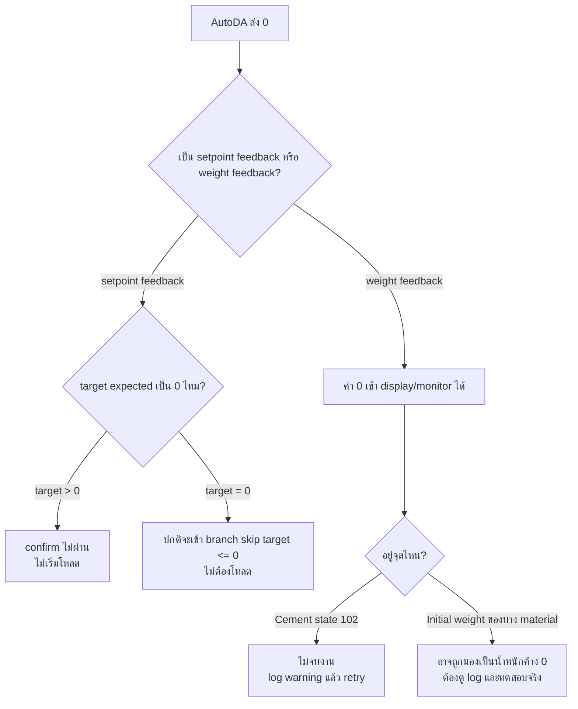

สถานะปัจจุบัน:

- setpoint feedback failure แก้แล้ว ไม่ใช้ `0` แทน failure
- weight feedback บาง path ใน `Autoda_controller.py` ยัง emit `0` เมื่ออ่านน้ำหนักไม่ได้ จึงยังเป็นจุดที่ควร monitor ตอนทดสอบจริง

## Abnormal Flow: PLC Status ไม่มา

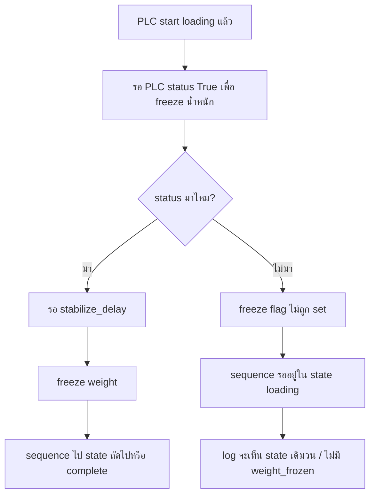

หมายเหตุ:

- completion signal ช่วยแก้กรณี sequence จบแล้วแต่ main flag ไม่เปลี่ยน
- แต่การจะ freeze น้ำหนักของหลายวัสดุยังพึ่ง PLC status อยู่ ถ้า PLC status ไม่มาเลย sequence อาจรออยู่ใน state นั้น

## Abnormal Flow: Cement น้ำหนักอ่านไม่ได้หรือเติมไม่ถึง

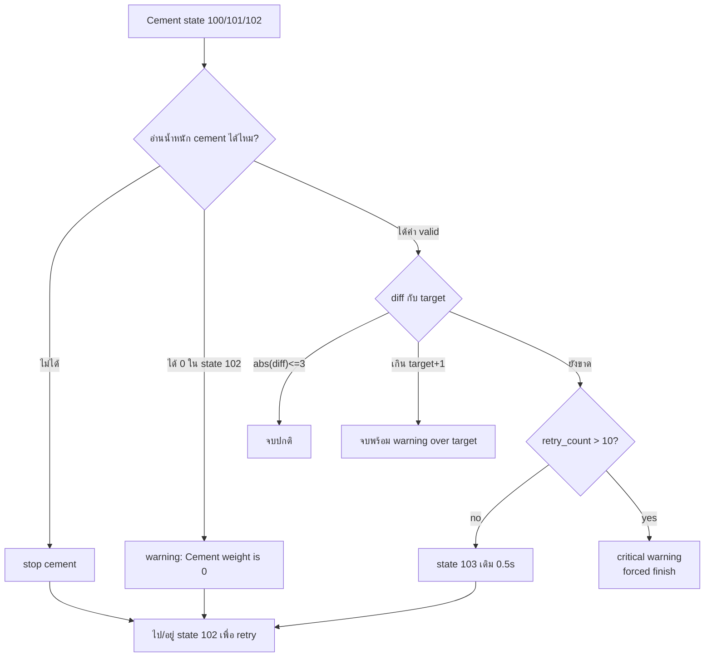

## จุดที่ต่างจากระบบเดิมมากน้อยแค่ไหน

| หัวข้อ | เดิม | หลังแก้ |
|---|---|---|
| Setpoint confirm | บางกลุ่ม bypass ด้วย `if x == x` | ทุกกลุ่มต้อง feedback ตรงก่อน PLC start |
| AutoDA read setpoint fail | emit `0`/`0.0` | emit `None` และ confirm fail |
| C&F completion | รอ PLC status callback รอบถัดไป | emit `cement_fyash_completed` เมื่อ sequence จบ |
| Rock/Sand, Water, Chemical completion | ยังเสี่ยงรอ callback เหมือนเดิม | มี completion signal ครบทุกกลุ่ม |
| Cement state 102 อ่าน 0 | เดิมเสี่ยงตีความผิดเป็นจบ | ไม่จบงาน, retry ต่อ |
| Rock/Sand ไม่มี Rock2 | เดิมมีโอกาสค้างหลัง Rock1 | complete พร้อม `skipped_rock2=True` |
| Logging | กระจายและจับ flow ยาก | มี `[TRACE]` ครอบคลุม command, feedback, freeze, flags, complete |
| State 103 เติมปูน | fixed 0.5s | คงเดิมตามผลทดสอบ hardware |

## Log ที่ควรเห็นในรอบปกติ

```text
[TRACE] queue_targets_prepared
[TRACE] thread_started | thread='rock_sand'
[TRACE] thread_started | thread='cement_fyash'
[TRACE] thread_started | thread='water'
[TRACE] thread_started | thread='chemical'
[TRACE] setpoint_calculated
[TRACE] autoda_command | command='write_set_point_...'
[TRACE] autoda_feedback | target='...'
[TRACE] plc_command | command='loading_...'
[TRACE] weight_frozen
[TRACE] sequence_complete
[TRACE] flags_snapshot | reason='..._completed'
Queue ... fully loaded - Setting next_queue_loaded_and_ready=True
```

## Log ที่ควรเฝ้าระวัง

```text
setpoint write failed
setpoint confirm failed
feedback None
Cement weight is 0 in state 102; retrying instead of completing.
Critical Error: เติมปูนหลายรอบแล้วน้ำหนักไม่ถึงเป้า
State 0 waiting - Flags: R&S=..., C&F=..., W=..., Chem=...
ไม่มี weight_frozen หลัง PLC start เป็นเวลานาน
```

## Checklist ทดสอบกับเครื่องจริง

1. Batch ปกติ 1 คิว: ต้องเห็นครบ `rock_sand_completed`, `cement_fyash_completed`, `water_completed`, `chemical_completed`
2. สูตรที่มี Cement ขาดเล็กน้อย: ต้องเข้า state 102 -> 103 -> 102 จน diff อยู่ในเกณฑ์
3. สูตรไม่มี Rock2: Rock/Sand ต้อง complete ไม่ค้าง state 4
4. สูตรมี material เป็น 0: ต้อง skip และ emit completed ได้
5. ปิด/หลุด AutoDA ชั่วคราวตอน read setpoint: ต้องไม่เริ่ม PLC loading ของ material นั้น
6. ทำให้ feedback setpoint เป็น 0 แต่ target > 0: ต้อง confirm fail และ retry
7. เช็ค log ว่าไม่มี `if x == x` behavior แบบเดิม คือไม่มีการ PLC start หลัง confirm fail
8. เช็คว่าถ้า PLC status ไม่มา จะเห็น state loading ค้างและไม่มี `weight_frozen` เพื่อใช้วินิจฉัย PLC/status line
